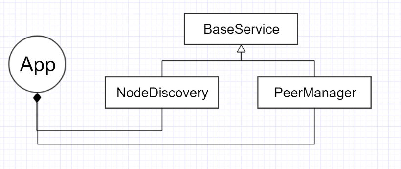
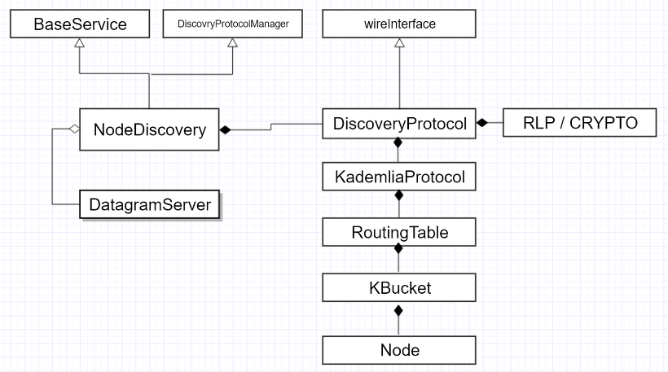
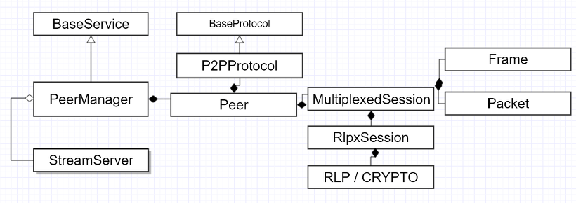

Introduction
------------

pydevp2p is the Python implementation of the RLPx network layer.
RLPx provides a general-purpose transport and interface for applications to communicate via a p2p network. The first version is geared towards building a robust transport, well-formed network, and software interface in order to provide infrastructure which meets the requirements of distributed or decentralized applications such as Ethereum. Encryption is employed to provide better privacy and integrity than would be provided by a cleartext implementation.

-----------------------------------------------------------

-----------------------------------------------------------

-----------------------------------------------------------

ref)https://hamait.tistory.com/968?category=276132

RLPx underpins the DEVp2p interface:

* `https://github.com/ethereum/wiki/wiki/ÐΞVp2p-Wire-Protocol <https://github.com/ethereum/wiki/wiki/ÐΞVp2p-Wire-Protocol>`_
* `https://github.com/ethereum/wiki/wiki/libp2p-Whitepaper <https://github.com/ethereum/wiki/wiki/libp2p-Whitepaper>`_

Full spec:

* https://github.com/ethereum/devp2p/blob/master/rlpx.md

Dependencies
------------

On Ubuntu::

    $ sudo apt-get install libssl-dev build-essential automake pkg-config libtool libffi-dev libgmp-dev

Features
--------
* Node Discovery and Network Formation
* Peer Preference Strategies
* Peer Reputation
* Multiple protocols
* Encrypted handshake
* Encrypted transport
* Dynamically framed transport
* Fair queuing

Security Overview
-------------------
* nodes have access to a uniform network topology
* peers can uniformly connect to network
* network robustness >= kademlia
* protocols sharing a connection are provided uniform bandwidth
* authenticated connectivity
* authenticated discovery protocol
* encrypted transport (TCP now; UDP in future)
* robust node discovery
